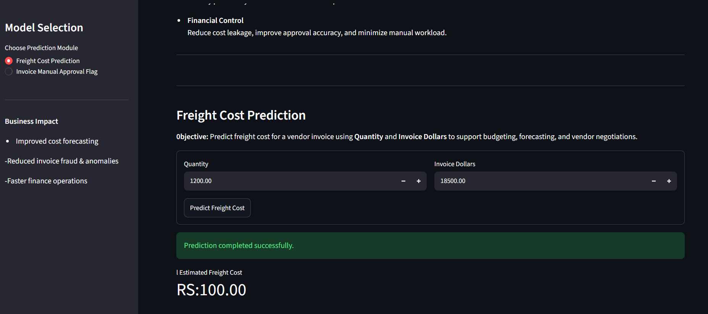
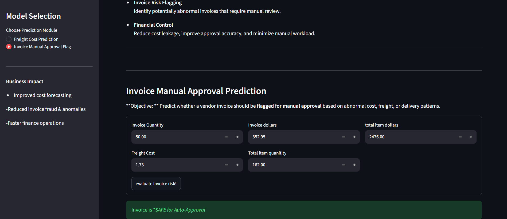

Absolutely. Here is the complete README.md as plain Markdown so you can copy-paste it directly into GitHub.

# Vendor Invoice Intelligence Portal

## Freight Cost Prediction & Invoice Risk Flagging

This project implements an end-to-end machine learning application designed to support finance and procurement teams by:

1. Predicting the expected freight cost for a vendor invoice.
2. Identifying potentially risky invoices that may require manual review.

The system combines **machine learning, data preprocessing, model evaluation, model persistence, and a Streamlit interface** into a single workflow.

---

## Table of Contents

- [Project Overview](#project-overview)
- [Business Objectives](#business-objectives)
  - [Freight Cost Prediction](#1-freight-cost-prediction-regression)
  - [Invoice Risk Flagging](#2-invoice-risk-flagging-classification)
- [Data Sources](#data-sources)
- [Exploratory Data Analysis](#exploratory-data-analysis-eda)
- [Models Used](#models-used)
- [Model Evaluation](#model-evaluation)
- [End-to-End Application](#end-to-end-application)
- [Project Structure](#project-structure)
- [How to Run This Project](#how-to-run-this-project)
- [Technologies Used](#technologies-used)
- [Key Learnings](#key-learnings)
- [Future Improvements](#future-improvements)

---

# Project Overview

Vendor invoices contain financial and operational information that can be useful for detecting unusual costs and improving procurement decisions.

This project uses two machine learning tasks:

### 1. Freight Cost Prediction

A regression model predicts the expected freight cost using invoice-related numerical features.

### 2. Invoice Risk Flagging

A classification model determines whether an invoice should be flagged for further review based on its financial and operational characteristics.

The final application brings both predictions together in an interactive **Streamlit dashboard**.

---

# Business Objectives

## 1. Freight Cost Prediction (Regression)


### Objective

Predict the expected freight cost for a vendor invoice using relevant invoice and transaction features.
<p align="center">
  
</p>
### Why it matters

- Freight is an important component of total procurement cost.
- Accurate freight estimation can improve budgeting and cost forecasting.
- Unexpected freight values can be investigated before financial approval.
- Historical invoice patterns can support better procurement decisions.

### Machine Learning Approach

This problem is treated as a **supervised regression problem** because the target variable is a continuous freight-cost value.

The workflow includes:

```text
Raw Data
   ↓
Data Cleaning
   ↓
Feature Selection
   ↓
Train/Test Split
   ↓
Regression Model Training
   ↓
Model Evaluation
   ↓
Model Serialization
   ↓
Freight Cost Prediction
```

---

## 2. Invoice Risk Flagging (Classification)

### Objective
<p align="center">
  
</p>

Predict whether an invoice should be flagged for manual review based on its invoice, freight, quantity, and financial characteristics.

### Why it matters

- Manual invoice review can be time-consuming.
- Unusual invoice patterns may indicate potential financial risk.
- Automated screening can prioritize invoices that need human attention.
- Early identification of abnormal invoices can improve financial control.

### Machine Learning Approach

This problem is treated as a **supervised classification problem** because the model predicts a categorical outcome: whether an invoice should be flagged.

The workflow includes:

```text
Invoice Data
   ↓
Data Cleaning
   ↓
Feature Engineering
   ↓
Train/Test Split
   ↓
Random Forest Classifier
   ↓
Model Evaluation
   ↓
Model Serialization
   ↓
Invoice Risk Prediction
```

---

# Data Sources

The project uses invoice and transaction data containing information relevant to freight cost and invoice risk.

Typical features used by the application include values such as:

- Invoice quantity
- Invoice value
- Freight cost
- Total quantity
- Total invoice amount
- Other derived invoice/transaction features

The data is processed using **Pandas** before being passed to the machine learning models.

### Data Processing

The preprocessing workflow includes:

- Loading the dataset
- Inspecting data types
- Handling missing values where required
- Selecting relevant features
- Splitting data into training and testing sets
- Ensuring prediction features match the features used during model training

---

# Exploratory Data Analysis (EDA)

Exploratory Data Analysis was performed to understand the structure and relationships within the dataset.

The analysis focuses on questions such as:

- How are invoice values distributed?
- How does freight cost relate to invoice quantity?
- Does invoice value have a relationship with freight cost?
- Are there unusual or extreme invoice values?
- What characteristics are associated with risky invoices?
- Are there highly correlated features?

### EDA Goals

EDA helps with:

- Understanding feature distributions
- Detecting outliers
- Identifying correlations
- Selecting useful features
- Understanding potential business patterns before model training

---

# Models Used

## Regression — Freight Cost Prediction

Multiple regression algorithms were evaluated:

### 1. Linear Regression

Used as a baseline model.

Linear Regression attempts to model the relationship between the input features and freight cost using a linear equation.

### 2. Decision Tree Regressor

Used to capture non-linear relationships between invoice features and freight cost.

### 3. Random Forest Regressor

An ensemble of multiple decision trees.

Random Forest was evaluated against the baseline models to determine whether a non-linear ensemble approach could improve freight-cost prediction.

---

## Classification — Invoice Risk Flagging

Multiple classification algorithms were evaluated:

### 1. Logistic Regression

Used as a baseline classification model.

### 2. Decision Tree Classifier

Used to model non-linear decision boundaries.

### 3. Random Forest Classifier

The final classification approach uses multiple decision trees and combines their predictions.

Random Forest was selected for the invoice-risk classification task based on its evaluation performance.

---

# Model Evaluation

## Freight Cost Prediction

Regression models were evaluated using:

- **MAE — Mean Absolute Error**
- **MSE — Mean Squared Error**
- **R² Score**

### Why these metrics?

**MAE** measures the average absolute difference between the predicted and actual freight cost.

**MSE** penalizes larger prediction errors more heavily.

**R² Score** measures how much of the variation in the target variable is explained by the model.

### Regression Results

| Model | MAE | MSE |                    R² Score |
|---|---:|---:|----------------------------:|
| Linear Regression | 30.90 | 13,346.57 | 0.9746,Best model evaluated |
| Decision Tree | 21.38 | 6,135.10 |                      0.9583 |
| Random Forest | 18.80 | 4,138.97 |                      0.9685 
The Linear regression model produced the lowest error among the evaluated regression models and was therefore preferred for the final freight-cost prediction workflow.


---

## Invoice Risk Classification

The classification model was evaluated using:

- Accuracy
- Precision
- Recall
- F1-score
- Classification Report

A test accuracy of approximately **96.03%** was obtained for the evaluated Random Forest classifier.

### Why F1-score matters

For invoice-risk detection, accuracy alone may not be sufficient.

The **F1-score** balances:

- **Precision** — how many invoices flagged as risky were actually risky.
- **Recall** — how many of the actual risky invoices were successfully detected.

This is particularly useful when the cost of missing a risky invoice is different from the cost of reviewing a normal invoice.

---

# End-to-End Application

The project includes an interactive **Streamlit** application that provides a simple interface for using the trained models.

The application allows the user to:

- Enter invoice-related information.
- Predict the expected freight cost.
- Evaluate an invoice for potential risk.
- Display the prediction result in a human-readable format.

### Application Flow

```text
User Input
    ↓
Streamlit Interface
    ↓
Input Validation / Feature Preparation
    ↓
Saved Machine Learning Model
    ↓
Prediction
    ↓
Human-Readable Result
```

The trained models are loaded from saved model files rather than retrained every time the application starts.

---

# Project Structure

```text
ai_frieghtcost/
│
├── data/
│   └── dataset files
│
├── models/
│   ├── predict_freight_model.pkl
│   ├── predict_invoice_flag.pkl
│   └── scaler.pkl
│
├── inference/
│   ├── freight_predict.py
│   └── predict_invoice_flag.py
│
├── freight_prediction/
│   ├── data_preprocessing.py
│   ├── model_evaluation.py
│   └── train.py
│
├── invoice_flagging/
│   ├── data_preprocessing.py
│   ├── model_evaluation.py
│   └── train.py
│
├── notebooks/
│   └── EDA / experimentation notebooks
│
├── app.py
├── README.md
├── .gitignore
└── requirements.txt
```

---

# How to Run This Project

## 1. Clone the Repository

```bash
git clone <your-github-repository-url>
cd ai_frieghtcost
```

---

## 2. Create a Virtual Environment

```bash
python -m venv venv
```

### Windows

```bash
venv\Scripts\activate
```

### macOS / Linux

```bash
source venv/bin/activate
```

---

## 3. Install Dependencies

```bash
pip install -r requirements.txt
```

If a `requirements.txt` file has not been created yet:

```bash
pip install pandas numpy scikit-learn streamlit matplotlib seaborn joblib
```

---

## 4. Train the Models

Run the respective training scripts after placing the required dataset in the project.

### Freight Cost Model

```bash
python freight_prediction/train.py
```

### Invoice Risk Model

```bash
python invoice_flagging/train.py
```

The trained models should then be saved inside the `models/` directory.

---

## 5. Test the Prediction Scripts

### Freight Prediction

```bash
python inference/freight_predict.py
```

### Invoice Risk Prediction

```bash
python inference/predict_invoice_flag.py
```

These scripts verify that the saved models can be loaded and used for inference.

---

## 6. Run the Streamlit Application

```bash
streamlit run app.py
```

The Streamlit application will open in the browser and provide an interactive interface for both machine learning tasks.

---

# Technologies Used

| Technology | Purpose |
|---|---|
| Python | Core programming language |
| Pandas | Data manipulation and preprocessing |
| NumPy | Numerical operations |
| Scikit-learn | Machine learning and evaluation |
| Matplotlib | Data visualization |
| Seaborn | Exploratory data analysis |
| Joblib / Pickle | Model serialization |
| Streamlit | Interactive web application |
| Git & GitHub | Version control and project hosting |

---

# Key Learnings

This project provided practical experience with an end-to-end machine learning workflow:

- Data loading and preprocessing
- Exploratory Data Analysis
- Feature selection
- Supervised learning
- Regression
- Classification
- Model comparison
- Model evaluation
- Random Forest
- Train/test splitting
- Model serialization
- Inference using saved models
- Streamlit application development
- Debugging feature mismatch issues
- Connecting machine learning models to a user interface

---

# Future Improvements

Possible improvements include:

- Add more historical invoice data.
- Introduce additional vendor-level features.
- Improve feature engineering.
- Add probability scores for invoice-risk predictions.
- Add SHAP or other explainability techniques.
- Add model monitoring and drift detection.
- Add automated data validation.
- Store predictions in a database.
- Add authentication for the internal dashboard.
- Deploy the Streamlit application to a cloud platform.
- Add automated model retraining when new invoice data becomes available.

---

# Project Outcome

The project demonstrates how machine learning can be integrated into a practical finance-oriented workflow.

Instead of using machine learning only for experimentation, the project connects:

```text
Data
 ↓
EDA
 ↓
Feature Engineering
 ↓
Model Training
 ↓
Model Evaluation
 ↓
Model Persistence
 ↓
Inference
 ↓
Streamlit Application
```

The final system provides two core capabilities:

### Freight Cost Prediction

Estimate the expected freight cost for an invoice.

### Invoice Risk Flagging

Identify invoices that may require additional manual review.

---

# Author

**Sree**

Machine Learning / AI Project

---

## License

This project is intended for educational and portfolio purposes.